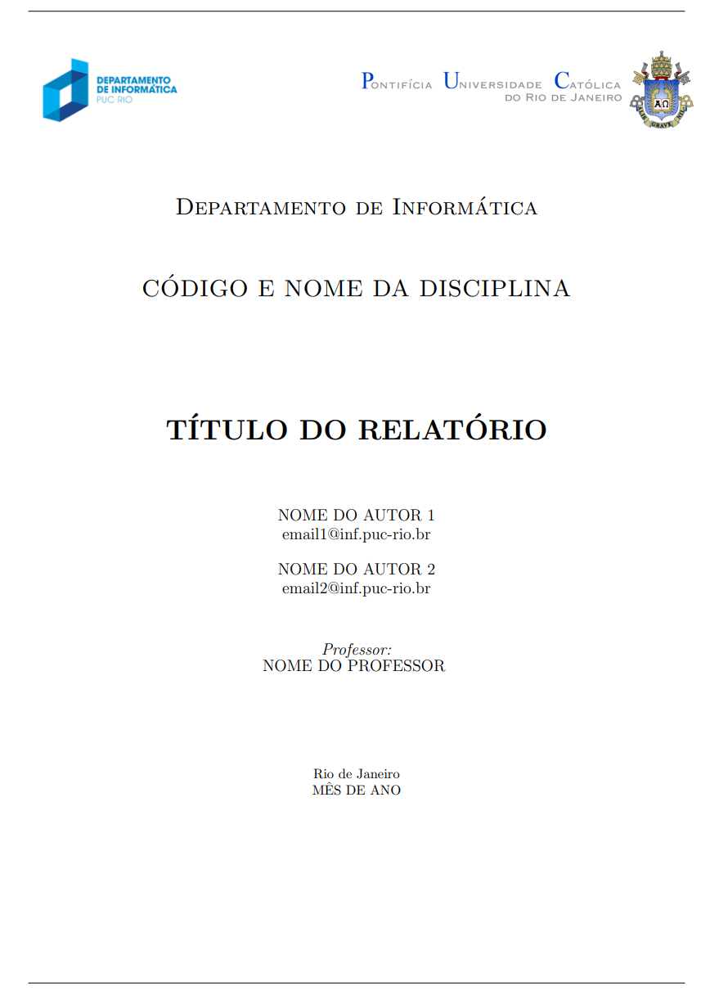

# Template de Relatório - Departamento de Informática PUC-Rio

Este é um template genérico para relatórios acadêmicos do Departamento de Informática da PUC-Rio.



## Estrutura do Template

```text
report_di_tex/
├── README.md
└── report/
    ├── main.tex          # Arquivo principal do documento
    ├── bib/
    │   ├── IEEEabrv.bib  # Abreviações IEEE
    │   └── references.bib  # Arquivo para suas referências bibliográficas
    ├── bst/
    │   └── IEEEtran.bst  # Estilo de bibliografia IEEE
    └── images/
        ├── di.png        # Logo do Departamento de Informática
        └── puc.png       # Logo da PUC-Rio
```

## Como Usar o Template

### 1. Personalizando o Documento

Abra o arquivo `report/main.tex` e substitua os seguintes placeholders:

- `TÍTULO DO RELATÓRIO` - Título do seu relatório
- `CÓDIGO E NOME DA DISCIPLINA` - Ex: "INF2670 Estruturas de Dados"
- `CÓDIGO DA DISCIPLINA` - Ex: "INF2670"
- `NOME DO AUTOR 1` - Nome do primeiro autor
- `email1@inf.puc-rio.br` - Email do primeiro autor
- `NOME DO AUTOR 2` - Nome do segundo autor (se houver)
- `email2@inf.puc-rio.br` - Email do segundo autor (se houver)
- `NOME DO PROFESSOR` - Nome do professor da disciplina
- `MÊS DE ANO` - Ex: "Dezembro de 2025"

### 2. Adicionando Conteúdo

O template possui a seguinte estrutura básica:

- **Introdução**: Contextualização, objetivos e metodologia
- **Resultados**: Apresentação dos resultados obtidos
- **Discussão**: Análise e interpretação dos resultados
- **Conclusão**: Conclusões e trabalhos futuros
- **Referências**: Bibliografia (gerenciada automaticamente)

### 3. Gerenciando Referências

1. Adicione suas referências no arquivo `bib/references.bib`
2. Use o comando `\cite{chave_da_referencia}` no texto para citar
3. As referências serão formatadas automaticamente no estilo IEEE

Exemplo de entrada no arquivo .bib:

```bibtex
@article{exemplo2024,
    author = {Silva, João},
    title = {Exemplo de Artigo},
    journal = {Revista de Informática},
    year = {2024},
    volume = {10},
    pages = {1-15}
}
```

### 4. Adicionando Figuras

Para adicionar figuras, coloque os arquivos na pasta `images/` e use:

```latex
\begin{figure}[!h]
\centering
\caption{Título da figura}
\includegraphics[width=0.6\hsize]{images/sua_figura.png}
\label{fig:exemplo}
\end{figure}
```

### 5. Adicionando Tabelas

Exemplo de tabela simples:

```latex
\begin{table}[!h]
\centering
\caption{Título da tabela}
\begin{tabular}{lc}
\toprule
\textbf{Parâmetro} & \textbf{Valor} \\
\midrule
Item 1 & Valor 1 \\
Item 2 & Valor 2 \\
\bottomrule
\end{tabular}
\label{tab:exemplo}
\end{table}
```

## Compilação

Para compilar o documento:

```bash
cd report/
latexmk -pdf main.tex
```

Ou usando pdflatex diretamente:

```bash
cd report/
pdflatex main.tex
biber main
pdflatex main.tex
pdflatex main.tex
```

## Recursos Incluídos

O template já inclui:

- Configuração de idioma (português)
- Pacotes essenciais para matemática, figuras e tabelas
- Formatação IEEE para referências
- Cabeçalho e rodapé personalizados
- Página de título formatada
- Estrutura organizacional padrão
- Suporte a código fonte (configurado para Matlab)
- Links coloridos para referências
- Comentários organizados seguindo melhores práticas LaTeX
- Documentação abrangente e exemplos práticos

## Personalização Avançada

### Alterando o Estilo de Código

O template está configurado para Matlab. Para outras linguagens, modifique a seção `\lstset` no preâmbulo:

```latex
\lstset{language=Python,  % ou C, Java, etc.
   % ... outras configurações
}
```

### Alterando Margens

Para alterar as margens do documento:

```latex
\marginsize{2cm}{2cm}{2cm}{2cm} % Esquerda, direita, superior, inferior
```

### Estrutura de Comentários

O template segue as **melhores práticas para comentários em LaTeX**:

- **Seções principais**: Delimitadas com linhas duplas (`=====`)
- **Grupos de pacotes**: Organizados logicamente por funcionalidade
- **Comentários inline**: Alinhados e descritivos
- **Exemplos**: Formatados com estrutura hierárquica clara
- **Instruções**: Detalhadas e em português brasileiro

Consulte o arquivo `docs/comentarios-latex.tex` para detalhes completos sobre as convenções adotadas.

## Dicas

1. **Sempre compile duas vezes** após adicionar referências
2. **Use rótulos** (`\label{}`) para referenciar figuras e tabelas automaticamente
3. **Mantenha as imagens** em resolução adequada (300 DPI para impressão)
4. **Organize o código** usando comentários para seções longas

## Suporte

Para dúvidas sobre LaTeX, consulte:

- [Overleaf Documentation](https://www.overleaf.com/learn)
- [LaTeX Wikibook](https://en.wikibooks.org/wiki/LaTeX)

---

*Template criado para o Departamento de Informática da PUC-Rio*
